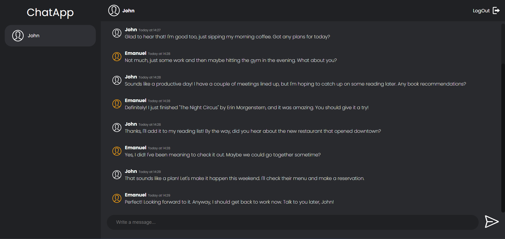

 

<h1 align="center">ChatApp</h1>

  

The ChatApp allows users to log in, send messages, and view messages from other users in real-time. It utilizes technologies such as HTML, CSS, JavaScript (with Socket.IO for real-time communication), Express.js for the server-side, and SQLite for database management. Users can log in with predefined credentials, send messages to other users, and view the message history. The application is designed to handle a maximum number of messages, ensuring efficient data management. It also includes features like remembering login credentials and displaying user avatars.
     
     
    <a href="https://chatapp-lorv.onrender.com">View Demo</a>
     
    Little disclaimer: if there is a longer lack of activity, you’ll have to wait about 30sec to load the app
     
    <h2>Login Data</h2>
    First User
     
    Email: 1
    Password: 1
     
     
    Second User
     
    Email: 2
    Password: 2
  

## About The Project

I recently embarked on a remarkable journey of creating a real-time chat application called "ChatApp" using HTML, CSS, and JavaScript, powered by Socket.IO for seamless communication. What made this project truly special was that it marked my inaugural foray into the realms of Node.js, Express.js, and SQLite. Through this endeavor, I navigated the complexities of server-side development with Node.js and Express.js, while also diving into database management with SQLite. This project not only allowed me to hone my skills in web development but also provided an invaluable learning experience as I delved into the world of backend technologies⚙️

### Built With

